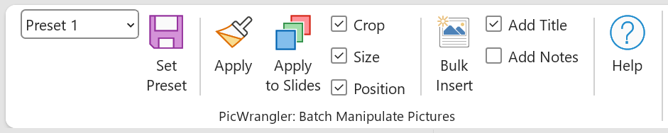

# PicWrangler

A PowerPoint COM Add-In (VSTO) that lets you save image crop, size, and position as reusable presets and apply them across slides in bulk. Also supports inserting multiple images into a presentation at once, one image per slide.



---

## Features

### Presets
- Capture an image's **crop**, **size**, and **position** into one of 4 named preset slots
- Apply a preset to a **single selected image** or to **all images across selected slides**
- Choose which properties to apply via the **Crop / Size / Position** checkboxes
- Presets are saved to disk and persist across PowerPoint sessions

### Bulk Insert
- Select one or more image files and insert them into the presentation, **one image per slide**
- New slides are inserted **after the currently active slide**
- **Add Title** — sets each slide's title to the image filename (enabled by default)
- **Add Notes** — writes the original file path to the slide notes

---

## Requirements

- Windows 10 or later
- Microsoft PowerPoint 2016 / 2019 / 365
- [Visual Studio Tools for Office (VSTO) Runtime](https://learn.microsoft.com/en-us/visualstudio/vsto/visual-studio-tools-for-office-runtime-installation-scenarios) — installed automatically by the setup package

---

## Installation

1. Download the latest release from the [Releases](../../releases) page
2. Unzip and run **`setup.exe`**
3. Open PowerPoint — the **ADD-INS** tab will contain the **PicWrangler: Batch Manipulate Pictures** group

---

## Usage

### Saving a Preset

1. Select an image in PowerPoint
2. Choose a preset slot from the dropdown (Preset 1–4)
3. Click **Set Preset**

### Applying a Preset

1. Select the target image
2. Check **Crop**, **Size**, and/or **Position** to choose what gets applied
3. Click **Apply**

### Applying to Multiple Slides

1. Select one or more slides in the slide panel (Normal or Slide Sorter view)
2. Click **Apply to Slides** — the preset is applied to every picture on every selected slide

### Bulk Insert

1. Click **Bulk Insert**
2. Select one or more image files in the dialog
3. Each image is inserted as a new slide immediately after the current slide

---

## Building from Source

**Prerequisites**
- Visual Studio 2022 with the **Office/SharePoint development** workload
- PowerPoint 2016 or later installed on the build machine

```
# Open the solution
PicWrangler.sln

# Build
Ctrl+Shift+B

# Debug (launches PowerPoint with the add-in loaded)
F5

# Publish (ClickOnce installer)
Build → Publish PicWrangler
```

> **Note:** If you have previously installed a ClickOnce build of PicWrangler on the same machine, uninstall it via **Windows Settings → Apps** before pressing F5, otherwise the debug and release registrations will conflict.

---

## Project Structure

```
PicWrangler/
├── PicWrangler/
│   ├── Ribbon/
│   │   ├── PicWranglerRibbon.cs   # Button/checkbox handlers
│   │   ├── PicWranglerRibbon.xml  # Ribbon UI layout
│   │   └── HelpDialog.cs          # Help window
│   ├── Models/                    # Preset, CropSettings, SizeSettings, PositionSettings
│   ├── Services/                  # PresetStore, ImageInspector, ImageApplicator
│   └── Helpers/                   # SelectionHelper
└── PicWranglerTests/              # Unit tests (.NET Framework)
```

---

## License

MIT
